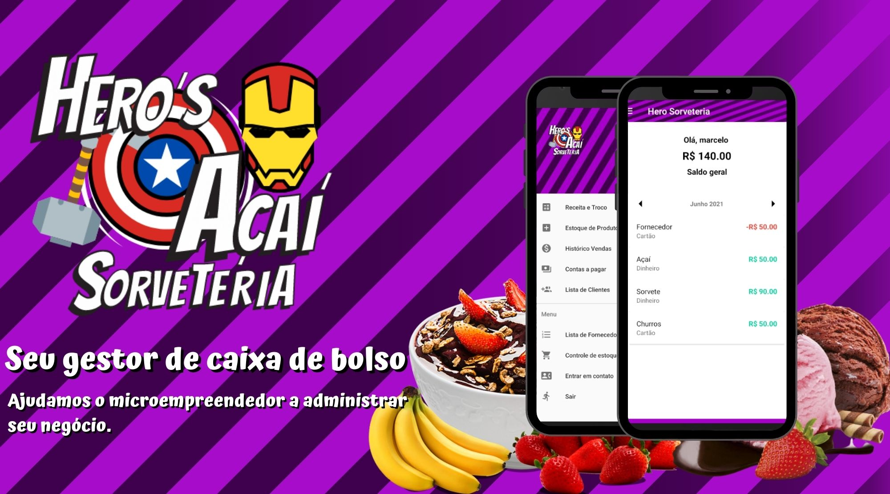

# Hero-Sorveteria-App
## Aplicativo voltado para a gestão de uma sorveteria de forma simples e prática, auxiliando o microempreededor no que diz respeito a controle de gastos, fluxo de caixa, gestão e estoque...

<h1 align="center">
  
</h1>

 <a href="#objetivo">Objetivo</a> •
 <a href="#roadmap">Roadmap</a> • 
 <a href="#tecnologias">Tecnologias</a> • 
 <a href="#contribuicao">Contribuição</a> • 
 <a href="#licenc-a">Licença</a> • 
 <a href="#autor">Autor</a>

<h4 align="center"> 
	🚧  Hero's Sorveteria-App 🍨 Em construção...  🚧
</h4>

## 💻 Sobre o projeto

🍨 Hero's Sorveteria-App - é uma forma de facilitar a gestão de pequenos negocios no segmento de sorvete de forma simples e prática, possuindo as ferramentas necessárias com a interface intuitiva.

Projeto desenvolvido por [Marcelo Laurentino](https://www.linkedin.com/in/marcelo-laurentino-8a54ba114/), com fins didáticos, onde tinha como
objetivo a criação de um CRUD praticar orientação a objetos com java e a implementação do banco de dados firebase.

### Features

- [x] Cadastro de usuário
- [x] Cadastro de cliente
- [x] Cadastro de produtos
- [x] Cadastro de receita
- [x] Controle de receita
- [x] Cadastro de despesas
- [x] Controle de despesas

### 🛠 Tecnologias

As seguintes ferramentas foram usadas na construção do projeto:

- [Java](https://www.java.com/pt-BR/)
- [Android Studio](https://developer.android.com/studio)
- [Firebase](https://firebase.google.com/)
